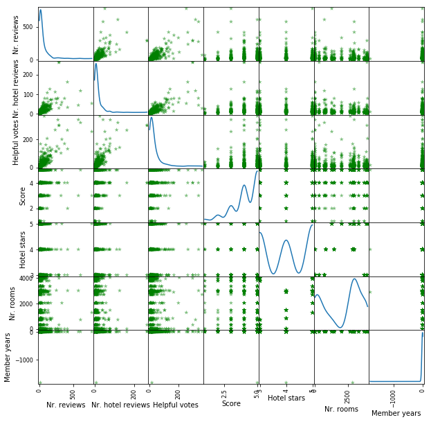
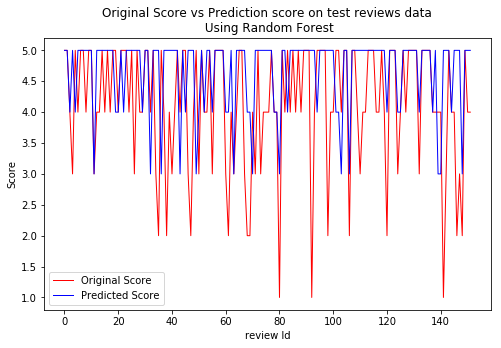

## Las Vegas TripAdvisor Score prediction using feature selection and classification

The dataset used in this project includes quantitative and categorical features from online reviews of 21 hotels located in Las Vegas Strip, extracted from TripAdvisor. All the 504 reviews were collected between January and August of 2015.

The dataset contains 504 records and 20 tuned features, 24 per hotel (two per each month, randomly selected), regarding the year of 2015. The CSV contains a header, with the names of the columns corresponding to the features

Aknowledgement : UCI Machine Learning Repository http://archive.ics.uci.edu/ml. Irvine, CA: University of California, School of Information and Computer Science


```python
## Import Useful Libraries
import matplotlib.pyplot as plt
import matplotlib
import numpy as np
import pandas as pd
from IPython.display import display
%matplotlib inline
```


```python
## Import data from data folder of project repo
data = pd.read_csv('../data/ratings.csv')
## preview data
data.head()
```


<div>
<style>
    .dataframe thead tr:only-child th {
        text-align: right;
    }

    .dataframe thead th {
        text-align: left;
    }

    .dataframe tbody tr th {
        vertical-align: top;
    }
</style>
<table border="1" class="dataframe">
  <thead>
    <tr style="text-align: right;">
      <th></th>
      <th>User country</th>
      <th>Nr. reviews</th>
      <th>Nr. hotel reviews</th>
      <th>Helpful votes</th>
      <th>Score</th>
      <th>Period of stay</th>
      <th>Traveler type</th>
      <th>Pool</th>
      <th>Gym</th>
      <th>Tennis court</th>
      <th>Spa</th>
      <th>Casino</th>
      <th>Free internet</th>
      <th>Hotel name</th>
      <th>Hotel stars</th>
      <th>Nr. rooms</th>
      <th>User continent</th>
      <th>Member years</th>
      <th>Review month</th>
      <th>Review weekday</th>
    </tr>
  </thead>
  <tbody>
    <tr>
      <th>0</th>
      <td>USA</td>
      <td>11</td>
      <td>4</td>
      <td>13</td>
      <td>5</td>
      <td>Dec-Feb</td>
      <td>Friends</td>
      <td>NO</td>
      <td>YES</td>
      <td>NO</td>
      <td>NO</td>
      <td>YES</td>
      <td>YES</td>
      <td>Circus Circus Hotel &amp; Casino Las Vegas</td>
      <td>3</td>
      <td>3773</td>
      <td>North America</td>
      <td>9</td>
      <td>January</td>
      <td>Thursday</td>
    </tr>
    <tr>
      <th>1</th>
      <td>USA</td>
      <td>119</td>
      <td>21</td>
      <td>75</td>
      <td>3</td>
      <td>Dec-Feb</td>
      <td>Business</td>
      <td>NO</td>
      <td>YES</td>
      <td>NO</td>
      <td>NO</td>
      <td>YES</td>
      <td>YES</td>
      <td>Circus Circus Hotel &amp; Casino Las Vegas</td>
      <td>3</td>
      <td>3773</td>
      <td>North America</td>
      <td>3</td>
      <td>January</td>
      <td>Friday</td>
    </tr>
    <tr>
      <th>2</th>
      <td>USA</td>
      <td>36</td>
      <td>9</td>
      <td>25</td>
      <td>5</td>
      <td>Mar-May</td>
      <td>Families</td>
      <td>NO</td>
      <td>YES</td>
      <td>NO</td>
      <td>NO</td>
      <td>YES</td>
      <td>YES</td>
      <td>Circus Circus Hotel &amp; Casino Las Vegas</td>
      <td>3</td>
      <td>3773</td>
      <td>North America</td>
      <td>2</td>
      <td>February</td>
      <td>Saturday</td>
    </tr>
    <tr>
      <th>3</th>
      <td>UK</td>
      <td>14</td>
      <td>7</td>
      <td>14</td>
      <td>4</td>
      <td>Mar-May</td>
      <td>Friends</td>
      <td>NO</td>
      <td>YES</td>
      <td>NO</td>
      <td>NO</td>
      <td>YES</td>
      <td>YES</td>
      <td>Circus Circus Hotel &amp; Casino Las Vegas</td>
      <td>3</td>
      <td>3773</td>
      <td>Europe</td>
      <td>6</td>
      <td>February</td>
      <td>Friday</td>
    </tr>
    <tr>
      <th>4</th>
      <td>Canada</td>
      <td>5</td>
      <td>5</td>
      <td>2</td>
      <td>4</td>
      <td>Mar-May</td>
      <td>Solo</td>
      <td>NO</td>
      <td>YES</td>
      <td>NO</td>
      <td>NO</td>
      <td>YES</td>
      <td>YES</td>
      <td>Circus Circus Hotel &amp; Casino Las Vegas</td>
      <td>3</td>
      <td>3773</td>
      <td>North America</td>
      <td>7</td>
      <td>March</td>
      <td>Tuesday</td>
    </tr>
  </tbody>
</table>
</div>


**Get data summary of numeric and categorical variables**


```python
display(data.describe(include=[np.number]))
display(data.describe(exclude=[np.number])) 
```


<div>
<style>
    .dataframe thead tr:only-child th {
        text-align: right;
    }

    .dataframe thead th {
        text-align: left;
    }

    .dataframe tbody tr th {
        vertical-align: top;
    }
</style>
<table border="1" class="dataframe">
  <thead>
    <tr style="text-align: right;">
      <th></th>
      <th>Nr. reviews</th>
      <th>Nr. hotel reviews</th>
      <th>Helpful votes</th>
      <th>Score</th>
      <th>Hotel stars</th>
      <th>Nr. rooms</th>
      <th>Member years</th>
    </tr>
  </thead>
  <tbody>
    <tr>
      <th>count</th>
      <td>504.000000</td>
      <td>504.000000</td>
      <td>504.000000</td>
      <td>504.000000</td>
      <td>504.000000</td>
      <td>504.000000</td>
      <td>504.000000</td>
    </tr>
    <tr>
      <th>mean</th>
      <td>48.130952</td>
      <td>16.023810</td>
      <td>31.751984</td>
      <td>4.123016</td>
      <td>4.047619</td>
      <td>2056.619048</td>
      <td>-0.055556</td>
    </tr>
    <tr>
      <th>std</th>
      <td>74.996426</td>
      <td>23.957953</td>
      <td>48.520783</td>
      <td>1.007302</td>
      <td>0.844650</td>
      <td>1455.775827</td>
      <td>80.664566</td>
    </tr>
    <tr>
      <th>min</th>
      <td>1.000000</td>
      <td>0.000000</td>
      <td>0.000000</td>
      <td>1.000000</td>
      <td>3.000000</td>
      <td>0.000000</td>
      <td>-1806.000000</td>
    </tr>
    <tr>
      <th>25%</th>
      <td>12.000000</td>
      <td>5.000000</td>
      <td>8.000000</td>
      <td>4.000000</td>
      <td>3.000000</td>
      <td>716.000000</td>
      <td>0.000000</td>
    </tr>
    <tr>
      <th>50%</th>
      <td>23.500000</td>
      <td>9.000000</td>
      <td>16.000000</td>
      <td>4.000000</td>
      <td>4.000000</td>
      <td>2700.000000</td>
      <td>3.000000</td>
    </tr>
    <tr>
      <th>75%</th>
      <td>54.250000</td>
      <td>18.000000</td>
      <td>35.000000</td>
      <td>5.000000</td>
      <td>5.000000</td>
      <td>3025.000000</td>
      <td>6.000000</td>
    </tr>
    <tr>
      <th>max</th>
      <td>775.000000</td>
      <td>263.000000</td>
      <td>365.000000</td>
      <td>5.000000</td>
      <td>5.000000</td>
      <td>4027.000000</td>
      <td>13.000000</td>
    </tr>
  </tbody>
</table>
</div>


<div>
<style>
    .dataframe thead tr:only-child th {
        text-align: right;
    }

    .dataframe thead th {
        text-align: left;
    }

    .dataframe tbody tr th {
        vertical-align: top;
    }
</style>
<table border="1" class="dataframe">
  <thead>
    <tr style="text-align: right;">
      <th></th>
      <th>User country</th>
      <th>Period of stay</th>
      <th>Traveler type</th>
      <th>Pool</th>
      <th>Gym</th>
      <th>Tennis court</th>
      <th>Spa</th>
      <th>Casino</th>
      <th>Free internet</th>
      <th>Hotel name</th>
      <th>User continent</th>
      <th>Review month</th>
      <th>Review weekday</th>
    </tr>
  </thead>
  <tbody>
    <tr>
      <th>count</th>
      <td>504</td>
      <td>504</td>
      <td>504</td>
      <td>504</td>
      <td>504</td>
      <td>504</td>
      <td>504</td>
      <td>504</td>
      <td>504</td>
      <td>504</td>
      <td>504</td>
      <td>504</td>
      <td>504</td>
    </tr>
    <tr>
      <th>unique</th>
      <td>48</td>
      <td>4</td>
      <td>5</td>
      <td>2</td>
      <td>2</td>
      <td>2</td>
      <td>2</td>
      <td>2</td>
      <td>2</td>
      <td>21</td>
      <td>7</td>
      <td>13</td>
      <td>8</td>
    </tr>
    <tr>
      <th>top</th>
      <td>USA</td>
      <td>Mar-May</td>
      <td>Couples</td>
      <td>YES</td>
      <td>YES</td>
      <td>NO</td>
      <td>YES</td>
      <td>YES</td>
      <td>YES</td>
      <td>Trump International Hotel Las Vegas</td>
      <td>North America</td>
      <td>Missing</td>
      <td>Missing</td>
    </tr>
    <tr>
      <th>freq</th>
      <td>217</td>
      <td>128</td>
      <td>214</td>
      <td>480</td>
      <td>480</td>
      <td>384</td>
      <td>384</td>
      <td>456</td>
      <td>480</td>
      <td>24</td>
      <td>232</td>
      <td>96</td>
      <td>96</td>
    </tr>
  </tbody>
</table>
</div>


**Plot a scatter matrix of all data features to understand collinearity and relationships**


```python
##Scatter matrix of features
pd.plotting.scatter_matrix(data,
                           figsize=(10,10), 
                           diagonal='kde', 
                           s=40,                            
                           alpha=0.5,
                           marker='*',
                           color='green');
```





> For the above dataset y-label will be the `score` and rest of the features will be used score prediction

**Data Cleaning**

> Many categorical variables have text labels but most machine learning algorithms in python accept data with numeric labels only therefore we'll be encoding the categorical variables to numeric labels


```python
## list of categorical variables which need encoding
categorical = list(data.select_dtypes(include=['object']).columns.values)
categorical
```


    ['User country',
     'Period of stay',
     'Traveler type',
     'Pool',
     'Gym',
     'Tennis court',
     'Spa',
     'Casino',
     'Free internet',
     'Hotel name',
     'User continent',
     'Review month',
     'Review weekday']


** Label Encoder in Scikit library is a great tool for quick encoding of character lables**


```python
from sklearn import preprocessing
le = preprocessing.LabelEncoder()
# seasons in place of months
['Dec-Feb' 'Mar-May' 'Jun-Aug' 'Sep-Nov']
data['Period of stay'] = data['Period of stay'].map({'Dec-Feb':'winter', 'Mar-May':'spring', 'Jun-Aug' :'summer','Sep-Nov':'autumn'})

```


```python
#Encoding categorical features with numbers
for i in range(0, len(categorical)):
    data[categorical[i]] = le.fit_transform(data[categorical[i]])
    
data.head()
```


<div>
<style>
    .dataframe thead tr:only-child th {
        text-align: right;
    }

    .dataframe thead th {
        text-align: left;
    }

    .dataframe tbody tr th {
        vertical-align: top;
    }
</style>
<table border="1" class="dataframe">
  <thead>
    <tr style="text-align: right;">
      <th></th>
      <th>User country</th>
      <th>Nr. reviews</th>
      <th>Nr. hotel reviews</th>
      <th>Helpful votes</th>
      <th>Score</th>
      <th>Period of stay</th>
      <th>Traveler type</th>
      <th>Pool</th>
      <th>Gym</th>
      <th>Tennis court</th>
      <th>Spa</th>
      <th>Casino</th>
      <th>Free internet</th>
      <th>Hotel name</th>
      <th>Hotel stars</th>
      <th>Nr. rooms</th>
      <th>User continent</th>
      <th>Member years</th>
      <th>Review month</th>
      <th>Review weekday</th>
    </tr>
  </thead>
  <tbody>
    <tr>
      <th>0</th>
      <td>46</td>
      <td>11</td>
      <td>4</td>
      <td>13</td>
      <td>5</td>
      <td>3</td>
      <td>3</td>
      <td>0</td>
      <td>1</td>
      <td>0</td>
      <td>0</td>
      <td>1</td>
      <td>1</td>
      <td>2</td>
      <td>3</td>
      <td>3773</td>
      <td>4</td>
      <td>9</td>
      <td>4</td>
      <td>5</td>
    </tr>
    <tr>
      <th>1</th>
      <td>46</td>
      <td>119</td>
      <td>21</td>
      <td>75</td>
      <td>3</td>
      <td>3</td>
      <td>0</td>
      <td>0</td>
      <td>1</td>
      <td>0</td>
      <td>0</td>
      <td>1</td>
      <td>1</td>
      <td>2</td>
      <td>3</td>
      <td>3773</td>
      <td>4</td>
      <td>3</td>
      <td>4</td>
      <td>0</td>
    </tr>
    <tr>
      <th>2</th>
      <td>46</td>
      <td>36</td>
      <td>9</td>
      <td>25</td>
      <td>5</td>
      <td>1</td>
      <td>2</td>
      <td>0</td>
      <td>1</td>
      <td>0</td>
      <td>0</td>
      <td>1</td>
      <td>1</td>
      <td>2</td>
      <td>3</td>
      <td>3773</td>
      <td>4</td>
      <td>2</td>
      <td>3</td>
      <td>3</td>
    </tr>
    <tr>
      <th>3</th>
      <td>45</td>
      <td>14</td>
      <td>7</td>
      <td>14</td>
      <td>4</td>
      <td>1</td>
      <td>3</td>
      <td>0</td>
      <td>1</td>
      <td>0</td>
      <td>0</td>
      <td>1</td>
      <td>1</td>
      <td>2</td>
      <td>3</td>
      <td>3773</td>
      <td>2</td>
      <td>6</td>
      <td>3</td>
      <td>0</td>
    </tr>
    <tr>
      <th>4</th>
      <td>3</td>
      <td>5</td>
      <td>5</td>
      <td>2</td>
      <td>4</td>
      <td>1</td>
      <td>4</td>
      <td>0</td>
      <td>1</td>
      <td>0</td>
      <td>0</td>
      <td>1</td>
      <td>1</td>
      <td>2</td>
      <td>3</td>
      <td>3773</td>
      <td>4</td>
      <td>7</td>
      <td>7</td>
      <td>6</td>
    </tr>
  </tbody>
</table>
</div>


### Data preparations for training and validation of classifiers

**Prepare train and test sets**


```python
## prepare train and test labels
from sklearn.model_selection import train_test_split
X= data.drop(['Score'], axis=1) ## remove score label from data
y = data['Score']
X_train, X_test, y_train, y_test = train_test_split(X, y, test_size=0.3, random_state=42)
```

**Recursive feature elimination (RFE) to select features by recursively considering smaller and smaller sets of features**


```python
##Applying random forest classifier on features to class

## Using feature selection pipeline and classification

from sklearn.ensemble import RandomForestClassifier
from sklearn.svm import LinearSVC
from sklearn.pipeline import Pipeline
from sklearn.feature_selection import SelectFromModel
from sklearn.feature_selection import RFE
from sklearn.linear_model import Ridge


rfe = RFE(estimator = Ridge(), n_features_to_select = 12)
rfe.fit(X_train, y_train)
feature_list = pd.DataFrame({'col':list(X_train.columns.values),'sel':list(rfe.support_ *1)})
print("*Most contributing features in Score*")
print()
print(feature_list[feature_list.sel==1].col.values)
```

    *Most contributing features in Score*
    
    ['Period of stay' 'Traveler type' 'Pool' 'Gym' 'Tennis court' 'Spa'
     'Casino' 'Free internet' 'Hotel name' 'Hotel stars' 'User continent'
     'Review weekday']
    

**Subset training data based on the most important(highest contribution) features**


```python
## Subset train data based on selected features
X_sel = pd.DataFrame(X_train, columns=(feature_list[feature_list.sel==1].col.values))
X_sel_t = pd.DataFrame(X_test, columns=(feature_list[feature_list.sel==1].col.values))
```

**Using selected features to fit the model for Score prediction**

> Using random forest classifier and kNN to predict score

**Using Random forest**


```python
clf = RandomForestClassifier(max_depth=5, random_state=0)
clf.fit(X_sel, y_train)
```


    RandomForestClassifier(bootstrap=True, class_weight=None, criterion='gini',
                max_depth=5, max_features='auto', max_leaf_nodes=None,
                min_impurity_decrease=0.0, min_impurity_split=None,
                min_samples_leaf=1, min_samples_split=2,
                min_weight_fraction_leaf=0.0, n_estimators=10, n_jobs=1,
                oob_score=False, random_state=0, verbose=0, warm_start=False)


**Using KNN for score prediction**


```python
from sklearn.neighbors import KNeighborsClassifier

knn = KNeighborsClassifier(n_neighbors=10)
knn.fit(X_sel, y_train) 
```


    KNeighborsClassifier(algorithm='auto', leaf_size=30, metric='minkowski',
               metric_params=None, n_jobs=1, n_neighbors=10, p=2,
               weights='uniform')


**Compare KNN and Random forest scores**


```python
print("KNN Score: ",knn.score(X_sel_t, y_test)*100,"\nRandom Forest Score ",clf.score(X_sel_t, y_test)*100)
```

    KNN Score:  43.4210526316 
    Random Forest Score  46.0526315789
    

**Random Forest gave better score than KNN on test data**
* Using Random forest for `Score` Prediction


```python
p = (list(clf.predict(X_sel_t)))
```


```python
Predictions = X_sel_t
Predictions['Original_Score']= y_test
Predictions['pred_score'] = p
Predictions.head()
```


<div>
<style>
    .dataframe thead tr:only-child th {
        text-align: right;
    }

    .dataframe thead th {
        text-align: left;
    }

    .dataframe tbody tr th {
        vertical-align: top;
    }
</style>
<table border="1" class="dataframe">
  <thead>
    <tr style="text-align: right;">
      <th></th>
      <th>Period of stay</th>
      <th>Traveler type</th>
      <th>Pool</th>
      <th>Gym</th>
      <th>Tennis court</th>
      <th>Spa</th>
      <th>Casino</th>
      <th>Free internet</th>
      <th>Hotel name</th>
      <th>Hotel stars</th>
      <th>User continent</th>
      <th>Review weekday</th>
      <th>Original_Score</th>
      <th>pred_score</th>
    </tr>
  </thead>
  <tbody>
    <tr>
      <th>173</th>
      <td>1</td>
      <td>2</td>
      <td>1</td>
      <td>1</td>
      <td>0</td>
      <td>1</td>
      <td>1</td>
      <td>1</td>
      <td>12</td>
      <td>5</td>
      <td>4</td>
      <td>0</td>
      <td>5</td>
      <td>5</td>
    </tr>
    <tr>
      <th>274</th>
      <td>2</td>
      <td>1</td>
      <td>1</td>
      <td>1</td>
      <td>0</td>
      <td>1</td>
      <td>1</td>
      <td>1</td>
      <td>3</td>
      <td>5</td>
      <td>2</td>
      <td>3</td>
      <td>5</td>
      <td>5</td>
    </tr>
    <tr>
      <th>489</th>
      <td>1</td>
      <td>1</td>
      <td>1</td>
      <td>1</td>
      <td>0</td>
      <td>1</td>
      <td>1</td>
      <td>1</td>
      <td>14</td>
      <td>4</td>
      <td>4</td>
      <td>6</td>
      <td>4</td>
      <td>4</td>
    </tr>
    <tr>
      <th>72</th>
      <td>3</td>
      <td>0</td>
      <td>1</td>
      <td>1</td>
      <td>1</td>
      <td>1</td>
      <td>1</td>
      <td>1</td>
      <td>15</td>
      <td>4</td>
      <td>2</td>
      <td>4</td>
      <td>3</td>
      <td>5</td>
    </tr>
    <tr>
      <th>305</th>
      <td>0</td>
      <td>4</td>
      <td>1</td>
      <td>1</td>
      <td>0</td>
      <td>1</td>
      <td>1</td>
      <td>1</td>
      <td>6</td>
      <td>3</td>
      <td>3</td>
      <td>1</td>
      <td>5</td>
      <td>4</td>
    </tr>
  </tbody>
</table>
</div>


```python
plt.figure(figsize=(8, 5))
ax = plt.subplot()
d = list(range(0,len(Predictions)))
p1 = plt.plot(d,Predictions['Original_Score'],'r-', label="Original Score", linewidth= 1 )#,data['gamma'],data['test_err'],'b-')
p2 = plt.plot(d,Predictions['pred_score'],'b-', label="Predicted Score", linewidth= 1)
ax.set_title('Original Score vs Prediction score on test reviews data\n Using Random Forest')
handles, labels = ax.get_legend_handles_labels()
ax.legend(handles, labels)
ax.set_xlabel('review Id')
ax.set_ylabel('Score')
plt.show()
```





**Summary**

The best prediction score achived using Random Forest with 12 features out of 19, is **46%** which is fairly low as the data is not so rich in my opinion

However Random Forest performed better than KNN in score prediction

Also the current classifier has overpredicted scores in most examples
